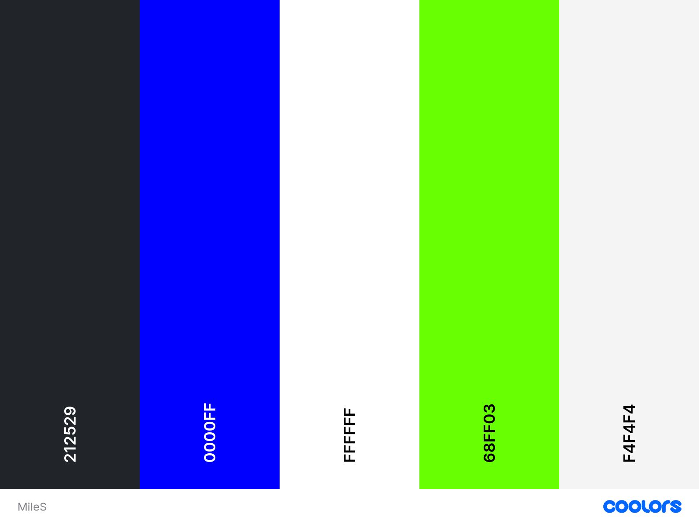

# Milestone01

My Milestone 1 Project
This is a website of a Dreadlocks saloon called I-Three. 
 We specialise in dreadlocks and natural hair care. Visitor have the opportunity to book.

 

 [View Milestone01 on Github Pages](https://apostle01.github.io/Milestone01/)

 

## CONTENTS

-[User Experience (UX)](#User-Experience-UX)

    -[User Stories](#User Stories)

-[Design](#Design)

    -[Colour Scheme](#Colour-Scheme)
    -[Typography](#Typography)
    -[Imagery](#Imagery)
    -[Wireframes](#Wireframes)
    -[Features](#Features)
    -[Accessibility](#Accessibility)

-[Technology Used](#Technologies-Used)

    -[Languages Used](#Languages-Used)
    -[Frameworks,Libraries & Programs Used](#Frameworks,-Libraries-and-Programs-Used)

-[Deployment and Local Development](#Deployment-and-Local-Development)

    -[Deployment](#Deployment)
    -[Local Development](#Local-Development)
        -[How to Fork](#How-to-Fork)
        -[How to Clone](#How-to-Clone)

    -[Testing](#Testing)
        -[W3C Validator](#W3C-Validator)
        -[Solved Bugs](#Solved-Bugs)
        -[Wave Testing](#Wave-Testing)
        -[Full Testing](#Full-Testing)
    -[Credits](#Credits)
        -[Code Used](#Code-Used)
        -[Media](#Media)
        -[Acknowledgments](#Acknowledgments)

        ---

    ## User Experience (UX)

    Milestone01 is a dreadlock saloon website with the aim of enhancing beauty with dreadlocks styling.

    ### User Stories

    #### Client goals

    -To be able to view the site on different divices
    -To make it easier for potential customers to view the packages we offer.
    -Have the ability to make a booking
    -Have customers access us easily and effortless.

    #### First Time Visitors Goals
        -Finding out what is on offer.
        -Would want to see pictures or video of previous work.
        -I want to be able to book or make contact.
        -I want to be able to navigate through the website with ease.

    #### Returning Visitors Goals

        -I want to be able to make a booking effortlessly.
    
    ## Design

    ### Colour Scheme

    