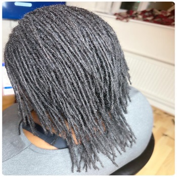

https://github.com/Apostle01/I-Three.git: This is a previous work that has a lot of commits but had to create a new repository (Milestone01) due to technical issues.
https://apostle01.github.io/I-Three/
https://github.com/Apostle01/Milestone01.git
https://apostle01.github.io/Milestone01/

My Milestone 1 Project.
This is a website for a Dreadlocks salon called I-Three.
We specialize in dreadlocks and natural hair care. Visitors have the opportunity to book appointments online.

 

 [View Milestone01 on Github Pages](https://apostle01.github.io/Milestone01/)

 

## CONTENTS

- [User Experience (UX)](#user-experience-ux)
    - [User Stories](#user-stories)

- [Design](#design)
    - [Colour Scheme](#colour-scheme)
    - [Typography](#typography)
    - [Imagery](#imagery)
    - [Wireframes](#wireframes)
    - [Features](#features)
    - [Accessibility](#accessibility)

- [Technology Used](#technology-used)
    - [Languages Used](#languages-used)
    - [Frameworks, Libraries & Programs Used](#frameworks-libraries-and-programs-used)

- [Deployment and Local Development](#deployment-and-local-development)
    - [Deployment](#deployment)
    - [Local Development](#local-development)
        - [How to Fork](#how-to-fork)
        - [How to Clone](#how-to-clone)

- [Testing](#testing)
    - [W3C Validator](#w3c-validator)
    - [Solved Bugs](#solved-bugs)
    - [Wave Testing](#wave-testing)
    - [Full Testing](#full-testing)

- [Credits](#credits)
    - [Code Used](#code-used)
    - [Media](#media)
    - [Acknowledgments](#acknowledgments)

---

## User Experience (UX)

Milestone01 is a dreadlock salon website with the aim of enhancing beauty through dreadlock styling.

### User Stories

#### Client Goals

- To be able to view the site on different devices.
- To make it easier for potential customers to view the packages we offer.
- Have the ability to make a booking.
- Have customers access us easily and effortlessly.

#### First Time Visitors' Goals

-  | Finding out what is on offer.
-  | Viewing pictures or videos of previous work.
-  | Being able to book or make contact.
-  | Navigating the website with ease.

#### Returning Visitors' Goals

-  | Effortlessly making a booking.

## Design

### Colour Scheme

I opted for a clean modern colour palette where each colour complements one another. The palette was created using the [Coolors](https://coolors.co/) website.

### Typography

Google Fonts was used for the following fonts:

- **Roboto** is used across the site for all text. It is a sans-serif font.

### Imagery

All images on the webpage were taken from Unsplash.com. I have credited these in the [Credits](#credits) section.

### Wireframes

- [Mobile](docs/wireframe.jpg)
- [Desktop](docs/wireframe1.jpg)
 
### Features

The website consists of three pages and a modal: Home, Packages, Gallery, and a Booking modal.

#### All three pages share the following elements:
- A responsive navigation bar at the top of the page allows the user to easily explore the website. On smaller devices, the navigation links are condensed into a burger toggler button to prevent the bar from looking cluttered.
 
- A footer comprising social media links to Facebook, Instagram, Twitter, and YouTube, along with the company's address.

### Home Page

- [Screenshot of Home page](docs/webpage.png)
Learn about our salon, our mission, and our commitment to excellence.

### Home Page: Learn about our salon, our mission, and our commitment to excellence.
 - Four different images of clean styled dreadlocks in the header.
 - A heading and paragraph explaining who I-Three are.
 - Four different images of clean styled dreadlocks in the header.

#### Packages Page

Explore our service packages, pricing, and special offers.

- Three packages are available: Starter, Maintenance, and Styling Perfection.
- Text explains the packages.
- A "Book Now" button under the packages directs users to the booking modal.
  <ul>
<li>Starter</li>
<li>Maintainance</li>
<li>Styling Perfection</li>
<a href="Booking.html">Booking.html</a>
</ul>

#### Gallery Page

View stunning photos of our clients’ dreadlocks transformations.

- A grid gallery showcasing I-Three's completed work, providing users confidence in the company’s ability.

I included a video of retwisting dreadlocks from YouTube:  
<iframe width="338" height="602" src="https://www.youtube.com/embed/hnn5DJqowX4" title="Retwist Tips for starter locs" allowfullscreen></iframe>

#### Booking Modal

- A modal which is initiated from a Booking button on the nav bar and the packages page.
- A form within the modal that requires the users input.

### Accessibility

I've taken care when coding to make the website user-friendly. This was done by:

- Using semantic HTML.
- Using descriptive alt attributes for images throughout the site.
- Selecting a sans-serif font which is suitable for users with dyslexia.
- Ensuring that the site has adequate amount of colour contrast.
  
## Technology Used

### Languages Used

- HTML
- CSS

### Frameworks, Libraries, and Programs Used

[Visual Studio Code](https://code.visualstudio.com/) IDE was used to create the website.

[Git](https://git-scm.com/) - For version control.

[Github](https://github.com/) - To save and store the files for the website.

[Bootstrap Version 4.2.1](https://getbootstrap.com/docs/4.2/getting-started/introduction/) - The framework for the website. Code for navigation bar, model and various other classes.
[Am I Responsive](https://ui.dev/amiresponsive) To show the website across a range of devices.

[Google Fonts](https://fonts.google.com/) - To import the fonts used on the website.

Google Dev Tools - To troubleshoot and test features, and solve issues with responsiveness and styling.

[Font Awesome](https://fontawesome.com/start) For social links.
          ---

## Deployment and Local Development

### Deployment

Github Pages was used to deploy the live website. The instructions to achieve this are below:

1. Log in (or sign up) to Github.
2. Find the repository for this project, I-Three Dreadlocks Saloon
3. Click on the Settings link.
4. Click on the Pages link in the left-hand side navigation bar.
5. In the Source section, choose main from the drop-down select branch menu. Select Root from the drop-down select folder menu.
6. Click Save. Your live Github Pages site is now deployed at the URL shown.

### Local Development

#### How to Fork

To fork the repository:

1. Log in (or sign up) to Github.
2. Go to the repository for this project, Apostle01/Milestone01
3. Click the Fork button in the top right corner.

#### How to Clone

To clone the Milestone01 repository:

1. Log in (or sign up) to GitHub.
2. Go to the repository for this project, Apostle01/Milestone01
3. Click on the code button, select whether you would like to clone with HTTPS, SSH or GitHub CLI and copy the link shown.
4. Open the terminal in your code editor and change the current working directory to the location you want to use for the cloned directory.
5. Type 'git clone' into the terminal and then paste the link you copied in step 3. Press enter.

## Testing

Testing was continuous throughout the website build. I used Chrome developer tools to identify and address any issues as they arose.

- Upon meeting with my mentor, we identified that my initial colour scheme had contrast issues. This has been resolved by choosing a new colour scheme that allows for adequate contrast been background and foreground colours.

- My mentor also pointed out that the images within the website were .png format which hindered the performance of the website. To combat this some images have been converted to .jpg format to significantly improve performance.

- On the Packages page. the list items were out of alignment and not centered even after using the bootstrap text-center class. This was due to padding, which has now been removed to center the list of items.

### Manual and Automated Testing
- Both automated and manual testing have their place in the software development lifecycle. Automated testing is best for repetitive, time-consuming tasks and ensures a high level of accuracy and efficiency. In contrast, manual testing is crucial for understanding the user experience, performing exploratory testing, and adapting to new, unforeseen test scenarios. By leveraging both types of testing, teams can ensure comprehensive test coverage, higher quality software, and a better user experience.

### W3C Validator

W3C validator was used to validate the HTML on all pages of the website. It was also used to validate CSS in the style.css file.

One issue I was coming across when testing my html page was an error displayed by w3. Trailing slash on void elements has no effect and interacts badly with unquoted attribute values.

- [index.html](assets/img/html-Validator.png)
- [style.css CSS](assets/img/CSS-Validator.png)

-[Jest](docs/JestFirst_test.png)
-[Jest](docs/JestSecondtest_jest.png)
-[Jest](docs/JestThirdtest_jest.png)

### Wave Testing
- [Index Page HTML](assets/img/Wavetest.png)
- [Packages Page HTML](assets/img/Wavetest1.png)
- [Gallery Page HTML](assets/img/Wavetest2.png)

### Full Testing

Full testing was performed on the following devices:

- Laptop:

  - Lenovo Laptop

- Mobile Devices:
  - iPhone 12 pro.
  - iPhone 11 pro.
  - Phone X.

Each device tested the site using the following browsers:

- Google Chrome
- Safari

#### Home Page

| Feature            | Expected Outcome                                                 | Testing Performed                  | Result                                      | Pass/Fail |
| ------------------ | ---------------------------------------------------------------- | ---------------------------------- | ------------------------------------------- | --------- |
| The sites logo     | Link directs the user back to the home page                      | Clicked title                      | Home page reloads                           | Pass      |
| Packages link      | Link directs user to Packages page                               | Clicked link                       | Packages page loads                         | Pass      |
| Gallery link       | Link directs user to Gallery page                                | Clicked link                       | Gallery page loads                          | Pass      |
| Links hover effect | All nav bar links highlight yellow when hovered over             | Hover over each button on the page | Each button turned yellow when hovered over | Pass      |
| Social links       | The corresponding social website opens on a new tab when clicked | Clicked social links               | Social website opens in new tab             | Pass      |
| Book Now Link      | Opens up booking modal                                           | Clicked link                       | Booking modal opens                         | Pass      |

#### Packages Page

| Feature                      | Expected Outcome                                                 | Testing Performed                  | Result                                      | Pass/Fail |
| ---------------------------- | ---------------------------------------------------------------- | ---------------------------------- | ------------------------------------------- | --------- |
| The sites logo               | Link directs the user back to the home page                      | Clicked title                      | Home page reloads                           | Pass      |
| Packages link                | Link directs user to Packages page                               | Clicked link                       | Packages page loads                         | Pass      |
| Gallery link                 | Link directs user to Gallery page                                | Clicked link                       | Gallery page loads                          | Pass      |
| Links hover effect           | All nav bar links highlight yellow when hovered over             | Hover over each button on the page | Each button turned yellow when hovered over | Pass      |
| Social links                 | The corresponding social website opens on a new tab when clicked | Clicked social links               | Social website opens in new tab             | Pass      |
| Book Now link                | Opens up booking modal                                           | Clicked link                       | Booking modal opens                         | Pass      |
| Book Now link under packages | Opens up booking modal                                           | Clicked link                       | Booking modal opens                         | Pass      |

#### Gallery Page

| Feature            | Expected Outcome                                                 | Testing Performed                  | Result                                      | Pass/Fail |
| ------------------ | ---------------------------------------------------------------- | ---------------------------------- | ------------------------------------------- | --------- |
| The sites logo     | Link directs the user back to the home page                      | Clicked title                      | Home page reloads                           | Pass      |
| Packages link      | Link directs user to Packages page                               | Clicked link                       | Packages page loads                         | Pass      |
| Gallery link       | Link directs user to Gallery page                                | Clicked link                       | Gallery page loads                          | Pass      |
| Links hover effect | All nav bar links highlight yellow when hovered over             | Hover over each button on the page | Each button turned yellow when hovered over | Pass      |
| Social links       | The corresponding social website opens on a new tab when clicked | Clicked social links               | Social website opens in new tab             | Pass      |
| Book Now Link      | Opens up booking modal                                           | Clicked link                       | Booking modal opens                         | Pass      |

#### 404 Page

| Feature            | Expected Outcome                                                 | Testing Performed                  | Result                                      | Pass/Fail |
| ------------------ | ---------------------------------------------------------------- | ---------------------------------- | ------------------------------------------- | --------- |
| The sites logo     | Link directs the user back to the home page                      | Clicked title                      | Home page reloads                           | Pass      |
| Packages link      | Link directs user to Packages page                               | Clicked link                       | Packages page loads                         | Pass      |
| Gallery link       | Link directs user to Gallery page                                | Clicked link                       | Gallery page loads                          | Pass      |
| Links hover effect | All nav bar links highlight yellow when hovered over             | Hover over each button on the page | Each button turned yellow when hovered over | Pass      |
| Social links       | The corresponding social website opens on a new tab when clicked | Clicked social links               | Social website opens in new tab             | Pass      |
| Book Now link      | Opens up booking modal                                           | Clicked link                       | Booking modal opens                         | Pass      |

#### Booking Modal

| Feature      | Expected Outcome         | Testing Performed | Result                   | Pass/Fail |
| ------------ | ------------------------ | ----------------- | ------------------------ | --------- |
| Book Button  | Opens confirmation modal | Clicked button    | Confirmation modal opens | Pass      |
| Close Button | Closes modal             | Clicked button    | Modal closes             | Pass      |

## Credits

### Code Used

I've used code and classes courtesy of Bootstrap, this can be seen throughout my code with comments.

W3 Schools for the favicon and learning how to manipulate a modal using JavaScript.

### Media

All my media was taken from [Unsplash](https://unsplash.com/).

### Acknowledgments

- My mentor for their guidance and support.
- My cohort for support.
- Code Institute for informative course material.
- The Slack community for help and support.

    
